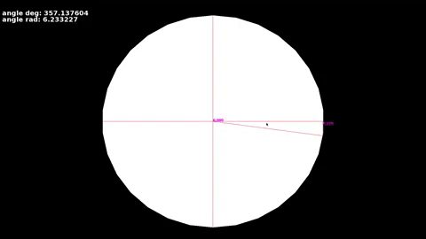

# trigtest

SFML is a graphics library for c++


Compile for Linux:

```sudo apt-get install libsfml-dev```

or go to the website ```https://www.sfml-dev.org```

To compile this program, first do:

```g++ -c trigtest.cpp```

then:

```g++ trigtest.o -o sfml-app -lsfml-graphics -lsfml-window -lsfml-system```

and to run it:

```./sfml-app```
